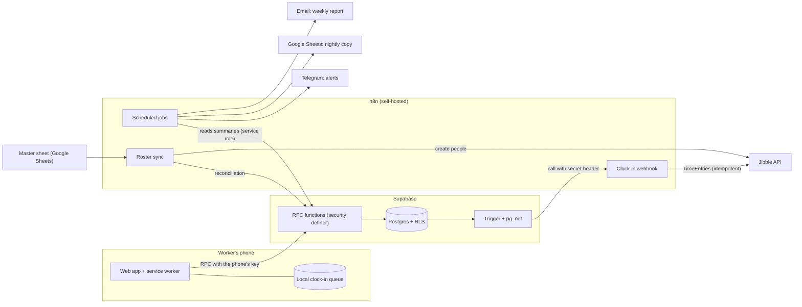

# Working-time tracking and daily reports for a construction subcontractor

🇪🇸 [Leer en español](README.md)

> Automation case study: replacing paper-based clock-in and daily work reports at a construction subcontracting company
> (≈40 workers on sites spread across Spain) with a custom web app integrated with a time-tracking service,
> plus alerts, reports and automatic onboarding/offboarding of workers.
>
> **Status:** complete and tested with the company's real data. Go-live planned for October 2026;
> results from the first weeks will be added in section 7.
> **Stack:** HTML/JS · Supabase (Postgres, RLS, RPC functions) · n8n · Jibble API · Netlify · Telegram · Google Sheets.

---

## 1. The problem

The company logged working time with a third-party tool and daily site reports through other channels. It lacked:

- A **reliable, auditable working-time record** (a legal obligation in Spain, with a 4-year retention period).
- **Daily work reports** per site, task and hours, **validated** by a site foreman.
- **Alerts** when someone doesn't clock in and **weekly reports** for management.
- **Hiring and termination of workers** without editing three systems by hand.

### Real-world constraints (what shaped the design)

| Constraint | Design consequence |
|---|---|
| Workers use **their own phones**, install nothing and **have no email** | Web app + single-use activation link sent over WhatsApp |
| Sites **without mobile coverage** (basements, rural areas) | **Offline** clock-in with a local queue and later sync |
| The record is **legal**: it must not be editable or spoofable | Immutable records, server-side timestamps, one phone = one person |
| Personal data (location, national ID) | Data minimisation, private tables, an information notice with proof of reading |
| One developer, almost no budget | Managed services + self-hosted n8n; logic in SQL |

---

## 2. Architecture



**Core idea:** the public app **never reads or writes tables directly**. It only calls RPC functions that validate the worker's
credential inside the database. n8n only **orchestrates**: business logic (who is missing, how many hours, what changes in the
roster) lives in SQL, where it can be tested in isolation.

### How it looks

<table>
  <tr>
    <td align="center"><br><sub>PIN-less entry<br>(trusted phone)</sub></td>
    <td align="center"><br><sub>Information notice<br>with proof of reading</sub></td>
    <td align="center"><br><sub>Shift in progress</sub></td>
  </tr>
  <tr>
    <td align="center"><br><sub>Daily work report<br>(site, task, hours)</sub></td>
    <td align="center"><br><sub>Clock-in without coverage:<br>stored and sent automatically</sub></td>
    <td></td>
  </tr>
</table>

<sub>Screenshots use made-up data. The UI is in Spanish because that is the users' language.</sub>

---

## 3. Key technical decisions and why

### 3.1 Identity without accounts: PIN → "trusted phone" → activation link

- Each worker initially had a **PIN** (stored with bcrypt). In practice, a PIN that 40 people must remember for a daily action
  **gets forgotten, and then people don't clock in**.
- Solution: the phone stores a **random 256-bit key**; the database only stores its **SHA-256 hash**. A phone remembers
  **one person only**, so nobody can hold several colleagues' identities on their device and clock in for them.
- Since nobody can be physically present at every site to hand out PINs, the phone is activated with a **personal single-use link**
  (7-day expiry, only its hash is stored). If forwarded, the second person to open it invalidates it, and the worker notices.
- Changing a PIN or terminating a worker **revokes their phones**.

### 3.2 Layered security

- **RLS** on every table; the public role (`anon`) cannot read clock-ins, hashes, national IDs or absences.
- **`security definer` functions** with a fixed `search_path`, `execute` revoked from `public` and granted only where needed.
- **`service_role` only in n8n**, never in the client or in exported workflows.
- **Authenticated webhooks** with a secret header stored in **Vault**; the database trigger reads it from there.
- **National ID and phone in a separate table** with no client-role policies: only n8n reads it, and it never appears in messages.
- I tested the critical accesses (clock-ins, IDs, absences, hashes, admin functions) **with the real `anon` role** (§5), not just by reading policies.

### 3.3 Immutable time record

- A trigger blocks deleting or editing a clock-in's essential fields.
- The timestamp is set by the **server** (`clock_timestamp()`), not the client, except for offline clock-ins (§3.4), which are **flagged**.
- The `fichar` function **validates the sequence** (in → break start → break end → out) before inserting.
- Every clock-in carries a **UUID generated on the phone**: if the client retries, the database recognises it and does not duplicate.

### 3.4 Clocking in without coverage

- The app is cached on the phone by a **service worker** and opens with no network.
- Offline, the clock-in goes to a **local queue** and is sent when the signal returns (`online` event, on app focus, and every 30 s).
- The server accepts the phone's timestamp within limits (not in the future, not older than 48 h), **flags the record as `sin_conexion`**
  and stores rejected ones in a review table.
- Any clock-in carrying a phone timestamp is offline, **with no time threshold** (an earlier version used 2 minutes and hid short outages; see §6).

### 3.5 Integration with the time-tracking service (Jibble)

- Postgres trigger → `pg_net` → n8n webhook → Jibble API, **in under a second**.
- A **safety net every minute** retries pending items; the same `id` guarantees **idempotency**, and "already exists" is treated as success.
- A live clock-in is sent **without a timestamp** (so the service treats it as a normal entry); a late one is sent **with** its timestamp (recorded as manual, which is the honest outcome).
- Telegram alert after 3 failures and when retries are exhausted.

### 3.6 Onboarding/offboarding from a master sheet

The company already managed hires and terminations with a Telegram bot over a spreadsheet. Instead of touching that flow,
**the sheet is the source of truth and the app reconciles** every 10 minutes (or instantly via a webhook):

| Case in the sheet | Action in the app |
|---|---|
| Active, not in the app | Create the worker and register them in Jibble (API) |
| Terminated, active in the app | Deactivate and **revoke their phones** (never delete) |
| Active, inactive in the app | Reactivate |
| Not in the sheet | **Left untouched** (e.g. office staff) |

Safeguards: a **dry-run mode** that shows the plan without changing anything, a **cap on terminations and hires per run**
(if the sheet were wrong, it blocks and alerts), matching by **national ID** and, the first time, by normalised name
only when the candidate is unique, and a **database lock** so two simultaneous runs can never create the same person twice.

### 3.7 Alerts and reports with logic in SQL

- The 9:30 alert groups by site. If **nobody** clocked in at a site, it collapses to one line ("holiday or stoppage?")
  instead of listing every worker. With sites in several regions, **a holiday calendar doesn't work**; what actually happens decides.
- Absences (holidays, sick leave, permits) exclude the person from the alert.
- The weekly report (hours clocked per worker, hours per site from daily reports, unclosed shifts) goes out via **Telegram + Excel by email**.
- A nightly copy of reports and clock-ins to Google Sheets acts as a second copy.

### 3.8 Data protection

- Location is captured **only at the moment of clocking in**; if permission is denied, the worker can still clock in.
- The previous system's **facial recognition was removed**.
- An **information notice inside the app** before the first clock-in, with **stored proof of reading** (version, date and time, also offline).
- This is not legal advice; the notice text is pending review by a specialist.

---

## 4. What is in this repository

```
.
├── sql/                          Database (didactic versions of what runs in production)
│   ├── 01_esquema_y_seguridad.sql        Tables, RLS, immutable record, sensitive data kept apart
│   ├── 02_identidad_movil_de_confianza.sql   Phone key, single-use link
│   ├── 03_fichar_y_sin_conexion.sql      Idempotent clock-in and offline clock-ins; information notice
│   ├── 04_sincronizacion_de_plantilla.sql    Reconciliation with safeguards and anti-duplicate lock
│   ├── 05_avisos_e_informes.sql          Per-site alerts and hours report
│   └── tests/ejemplo_test_con_rollback.sql   Rollback-based testing pattern
├── frontend/
│   ├── cliente_offline_y_activacion.js   Excerpt: offline queue, trusted phone, notice
│   └── sw.js                             Service worker
├── n8n/
│   ├── README.md                         What each workflow does
│   └── code-nodes/                       Logic of the Code nodes (no credentials)
└── docs/img/                             Screenshots (made-up data)
```

**This is an excerpt, not the full project.** Some pieces (the full app, exported workflows, helper functions) are left out because they contain
company data and configuration. What is included is meant for **reading the decisions**, not for deploying as-is. Identifiers and comments are in Spanish.

---

## 5. How I tested it

There is no CI with automated tests yet (see limitations). What I did, systematically:

- **SQL tests with rollback** (example in [`sql/tests/`](sql/tests/ejemplo_test_con_rollback.sql)): a block that runs real scenarios against real data and ends with an exception to **undo everything**,
  returning each case's result. This exercises hires, terminations, duplicates, safeguards and retries without dirtying the database.
- **Permissions with the real role:** `set local role anon` and checking that every improper access fails (clock-ins, IDs, absences, hashes, functions).
- **Browser automation (Playwright)** with simulated server responses, including **cutting the network for real** and **shutting the server down**
  to test offline mode.
- **Manual tests on a real phone** (an iPhone in airplane mode), then verifying in the database and in the time-tracking service.
- **End-to-end checks:** an offline clock-in shows up in the time-tracking service with its real time, flagged, without duplication.

---

## 6. Mistakes I found and what I learned

1. **My first offline test said "all good" and on a real iPhone the app wouldn't load.** The service worker returned `index.html`
   for *any* failed request, including the JS library. The test missed it because the test browser lets the service worker
   use the network. *Lesson:* test offline mode by **shutting the server down**, not just by simulating "offline".
2. **A query broke when I added a table.** An implicit PostgREST `JOIN` became ambiguous once two relationships existed
   between the same tables. *Lesson:* when creating a new relationship, look for the queries that join those tables.
3. **A wrong conclusion from a test without a control.** I checked whether Jibble's API archives or deletes a person by filtering on id,
   without first checking that the filter worked. The result ("fully deleted") looked suspicious. I repeated the test **with a control** (list before and after) and it
   held, but for the right reason. *Lesson:* every negative test needs a control case. **That is why terminations in Jibble are not automated**: the API can only delete outright.
4. **A "reasonable" rule that hid data.** It flagged a clock-in as offline only if it took over 2 minutes; a short outage came out unflagged with the server's time.
   It now depends on the record's **origin**, not on a time threshold.

---

## 7. Results

*(To be updated after the first weeks of use, with measured data. No figures that haven't been measured.)*

- Workers using the app: `[ ]` of `[ ]`
- % of clock-ins with a correct time / no manual correction: `[ ]`
- Weekly office time saved reconciling hours and reports: `[ ]`
- Offline clock-ins recovered correctly: `[ ]`
- Incidents in the first 2 weeks: `[ ]`

---

## 8. Limitations and next steps

- **No automated tests in CI:** the scenarios exist, but they are scripts run by hand. Turning them into a reproducible suite is the next step.
- **Auditable corrections:** today a correction is made in the time-tracking service and isn't traced in the own database. A corrections table
  (who, when, what changed) is missing.
- **Terminations in the time-tracking service:** manual by design (the API deletes instead of archiving).
- **Automatic creation in the time-tracking service:** the API call was tested in isolation against the real service; the full integration
  (with its anti-duplicate lock) was tested with simulated data and will be validated with the first real hire.
- **Own monitoring:** alerts depend on n8n and Telegram; a health dashboard is missing.
- **Compliance:** the information text and personal-data processing need review by a specialist before go-live.

---

## 9. How I worked

> I defined the requirements and real-world constraints with the company, made the product decisions and ran the tests in the live environment.
> I built the system iteratively with an AI assistant (Claude): it generated much of the code and the workflows, and I reviewed it, tested it
> and validated each piece against real data before accepting it.

---

## 10. Stack

`HTML/JS` · `Service Worker` · `Supabase (Postgres, RLS, RPC, Vault, pg_net)` · `n8n` · `Jibble API (OAuth2)` · `Netlify` ·
`Telegram Bot API` · `Google Sheets API` · `Playwright` (testing)

---

**Author:** Víctor Herreros Arenas · [LinkedIn](https://www.linkedin.com/in/víctor-herreros-arenas-776835401/) · [GitHub](https://github.com/vautomatiza26-bit)
**License:** MIT (see [`LICENSE`](LICENSE)).

*Company, worker and site data anonymised. This repository contains no keys, real identifiers or personal data.*
