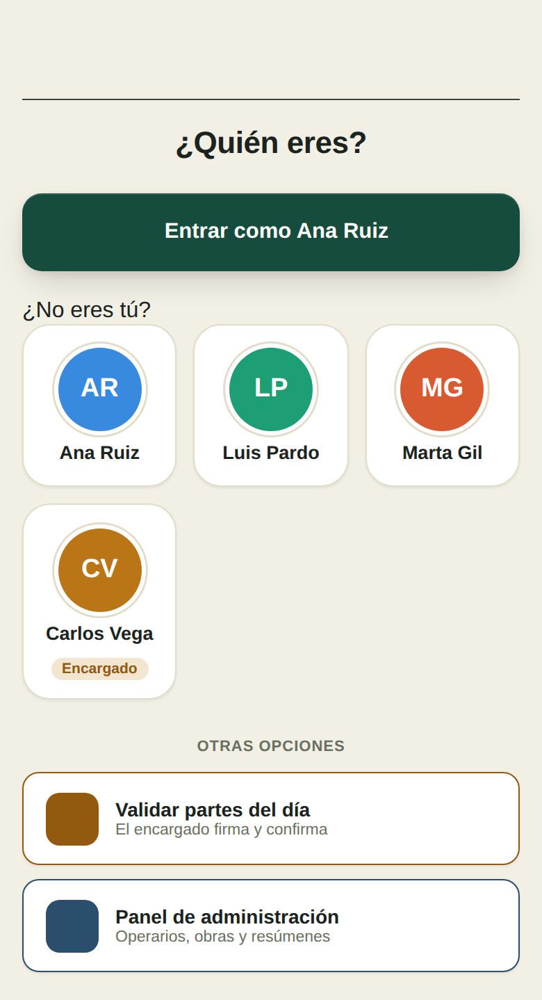
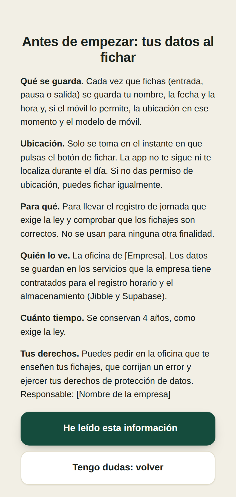
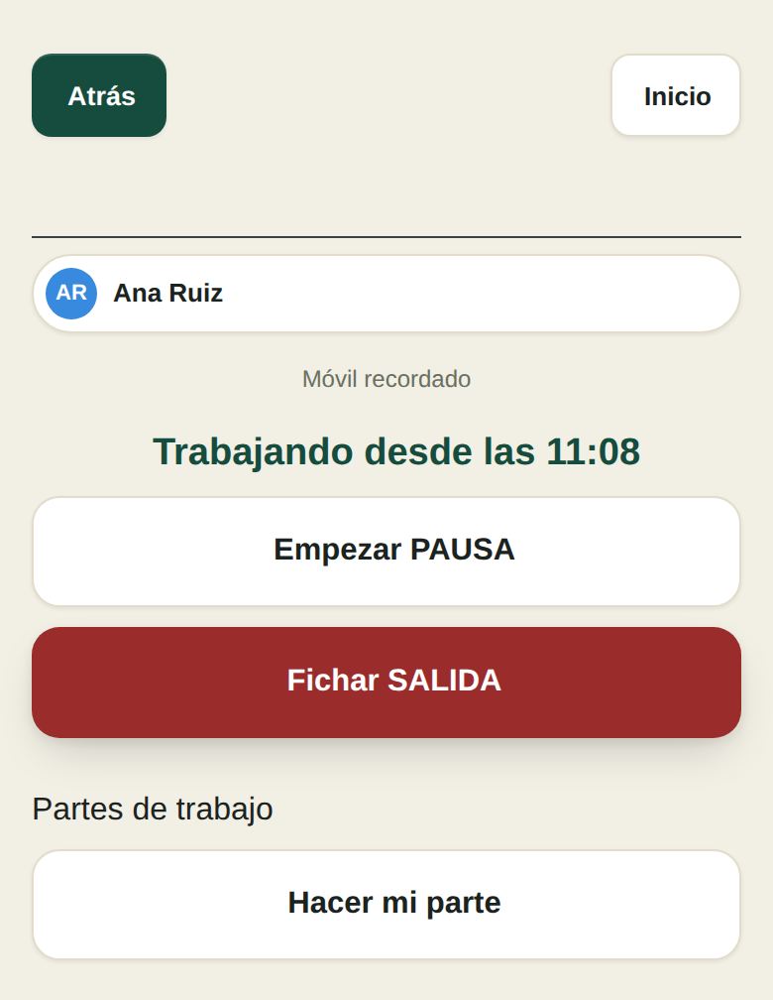
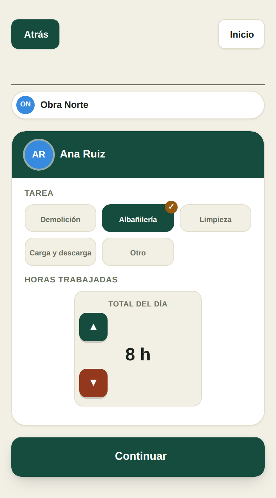
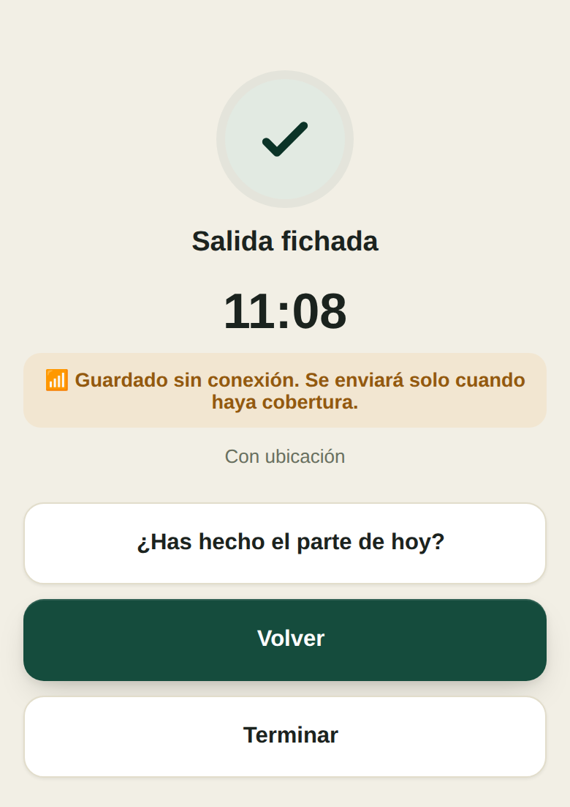
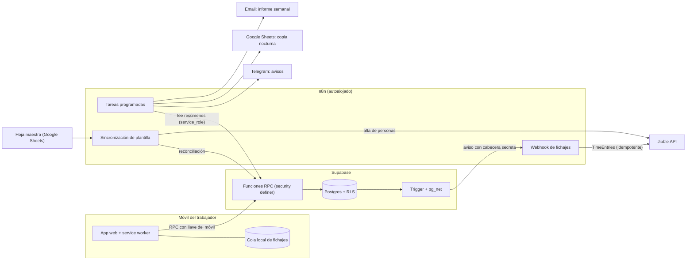

# Control de jornada y partes de trabajo para una empresa de obra

🇬🇧 [Read this in English](README.en.md)

> Caso práctico de automatización: sustituir el fichaje y los partes en papel de una empresa de subcontratación
> (≈40 operarios en obras repartidas por España) por una app web propia, integrada con un sistema de registro
> horario, con avisos, informes y altas/bajas automáticas.
>
> **Estado:** sistema completo y probado con datos reales de la empresa. Puesta en producción prevista para octubre de 2026;
> los resultados de las primeras semanas se añadirán en la sección 7.
> **Stack:** HTML/JS · Supabase (Postgres, RLS, funciones RPC) · n8n · Jibble API · Netlify · Telegram · Google Sheets.

---

## 1. El problema

La empresa registraba la jornada con una herramienta de terceros y los partes de obra por otros canales. Faltaba:

- Un **registro de jornada fiable y auditable** (obligación legal, conservación 4 años).
- **Partes de trabajo** por obra, tarea y horas, con **validación** del encargado.
- **Avisos** cuando alguien no ficha y **informes** semanales para la dirección.
- **Altas y bajas de trabajadores** sin tener que tocar tres sistemas a mano.

### Restricciones reales (las que condicionaron el diseño)

| Restricción | Consecuencia en el diseño |
|---|---|
| Los trabajadores usan **su móvil**, no instalan apps y **no tienen email** | App web + activación por enlace de WhatsApp de un solo uso |
| Obras **sin cobertura** (sótanos, zonas rurales) | Fichaje **offline** con cola local y sincronización |
| El registro es **legal**: no puede editarse ni suplantarse | Fichajes inmutables, hora del servidor, un móvil = una persona |
| Datos personales (ubicación, DNI) | Mínimo dato necesario, tablas privadas, aviso informativo con constancia |
| Un solo desarrollador, presupuesto casi nulo | Servicios gestionados + n8n autoalojado; lógica en SQL |

### Cómo se ve

<table>
  <tr>
    <td align="center"><br><sub>Entrada sin PIN<br>(móvil de confianza)</sub></td>
    <td align="center"><br><sub>Aviso informativo<br>con constancia de lectura</sub></td>
    <td align="center"><br><sub>Jornada en curso</sub></td>
  </tr>
  <tr>
    <td align="center"><br><sub>Parte de trabajo<br>(obra, tarea, horas)</sub></td>
    <td align="center"><br><sub>Fichaje sin cobertura:<br>se guarda y se envía solo</sub></td>
    <td></td>
  </tr>
</table>

<sub>Capturas con datos ficticios. La interfaz está en español porque es la lengua de los usuarios.</sub>

---

## 2. Arquitectura



**Idea central:** la app pública **nunca lee ni escribe tablas directamente**. Solo llama a funciones RPC que validan la
credencial del trabajador dentro de la base de datos. n8n solo **orquesta**: la lógica de negocio (quién falta, cuántas horas,
qué cambia en la plantilla) vive en SQL, donde se puede probar de forma aislada.

---

## 3. Decisiones técnicas y por qué

### 3.1 Identidad sin cuentas: PIN → "móvil de confianza" → enlace de activación

- Inicialmente cada trabajador tenía un **PIN** (guardado con bcrypt). En la práctica, un PIN para 40 personas que fichan
  a diario **se olvida y hace que no fichen**.
- Solución: el móvil guarda una **llave aleatoria de 256 bits**; en la base de datos solo se almacena su **hash SHA-256**.
  Un móvil recuerda **a una sola persona**, así que nadie puede tener guardados a varios compañeros y fichar por ellos.
- Como no se puede estar presente en cada obra para dar el PIN, el móvil se activa con un **enlace personal de un solo uso**
  (caduca a los 7 días, se guarda solo el hash). Si se reenvía, el segundo en abrirlo lo invalida y el trabajador lo nota.
- Cambiar el PIN o dar de baja a alguien **anula sus móviles**.

### 3.2 Seguridad por capas

- **RLS** activado en todas las tablas; el rol público (`anon`) no puede leer fichajes, hashes, DNI ni ausencias.
- **Funciones `security definer`** con `search_path` fijado, `execute` revocado a `public` y concedido solo al rol necesario.
- **`service_role` solo en n8n**, nunca en el cliente ni en los flujos exportados.
- **Webhooks autenticados** con cabecera secreta guardada en **Vault**; el trigger de la base de datos la lee de allí.
- **DNI y teléfono en una tabla aparte**, sin políticas para ningún rol de cliente: solo la lee n8n, y no aparece en los mensajes.
- Probé los accesos críticos (fichajes, DNI, ausencias, hashes, funciones de administración) **con el rol `anon` real** (§5), no solo revisando las políticas.

### 3.3 Registro de jornada inmutable

- Un trigger bloquea el borrado y la edición de los datos esenciales de un fichaje.
- La hora la pone el **servidor** (`clock_timestamp()`), no el cliente, salvo en fichajes sin conexión (§3.4), que quedan **marcados**.
- La función `fichar` **valida la secuencia** (entrada → pausa → fin de pausa → salida) antes de insertar.
- Cada fichaje lleva un **UUID generado en el móvil**: si el cliente reintenta, la base de datos lo reconoce y no duplica.

### 3.4 Fichar sin cobertura

- La app se guarda en el móvil con un **service worker** y abre sin red.
- Sin conexión, el fichaje va a una **cola local** y se envía solo al recuperar señal (evento `online`, al volver a la app y cada 30 s).
- El servidor acepta la hora del móvil con límites (no en el futuro, no más de 48 h atrás), **marca el fichaje como `sin_conexion`**
  y guarda los rechazados en una tabla de revisión.
- Cualquier fichaje que trae hora del móvil es "sin conexión", **sin umbral de tiempo** (una versión anterior usaba 2 minutos y ocultaba los cortes cortos; ver §6).

### 3.5 Integración con el sistema de registro horario (Jibble)

- Trigger en Postgres → `pg_net` → webhook de n8n → API de Jibble, **en menos de un segundo**.
- Una **red de seguridad cada minuto** reintenta los pendientes; el mismo `id` garantiza **idempotencia**, y "ya existe" se trata como éxito.
- Un fichaje en directo se envía **sin hora** (el sistema lo trata como normal); uno tardío se envía **con hora** (queda como manual, que es lo honesto).
- Avisa por Telegram al fallar 3 veces y al agotar los reintentos.

### 3.6 Altas y bajas desde la hoja maestra

La empresa ya gestionaba altas y bajas con un bot de Telegram sobre una hoja de cálculo. En lugar de tocar ese flujo,
**la hoja manda y la app se reconcilia** cada 10 minutos (o al instante mediante un webhook):

| Caso en la hoja | Acción en la app |
|---|---|
| Alta, no existe en la app | Crear trabajador y darlo de alta en Jibble (API) |
| Baja, activo en la app | Desactivar y **anular sus móviles** (nunca borrar) |
| Alta, inactivo en la app | Reactivar |
| No aparece en la hoja | **No se toca** (p. ej. personal de oficina) |

Salvaguardas: **modo simulación** que enseña el plan sin cambiar nada, **límite de bajas y altas por ejecución**
(si la hoja tuviera un fallo, se bloquea y se avisa), emparejamiento por **DNI** y, la primera vez, por nombre normalizado
solo si el candidato es único, y un **candado en base de datos** para que dos ejecuciones simultáneas no creen a la misma persona dos veces.

### 3.7 Avisos e informes con la lógica en SQL

- El aviso de las 9:30 agrupa por obra. Si en una obra **no ha fichado nadie**, la resume en una línea ("¿festivo o parada?")
  en lugar de listar a cada trabajador. Con obras en varias comunidades, **un calendario de festivos no sirve**; lo decide lo que ocurre.
- Ausencias (vacaciones, bajas, permisos) descuentan a la persona del aviso.
- El informe semanal (horas fichadas por trabajador, horas por obra según partes, jornadas sin cerrar) sale a **Telegram + Excel por email**.
- Copia nocturna de partes y fichajes a Google Sheets, como segunda copia.

### 3.8 Protección de datos

- Ubicación **solo en el instante de fichar**; si no se da permiso, se ficha igualmente.
- Se **retiró el reconocimiento facial** del sistema anterior.
- **Aviso informativo dentro de la app** antes del primer fichaje, con **constancia guardada** (versión, fecha y hora, también sin conexión).
- Este proyecto no es asesoramiento legal; el texto del aviso está pendiente de revisión por un especialista.

---

## 4. Qué hay en este repositorio

```
.
├── sql/                          Base de datos (versiones didácticas de lo que corre en producción)
│   ├── 01_esquema_y_seguridad.sql        Tablas, RLS, registro inmutable, datos privados aparte
│   ├── 02_identidad_movil_de_confianza.sql   Llave del móvil, enlace de un solo uso
│   ├── 03_fichar_y_sin_conexion.sql      Fichar con idempotencia y fichajes sin conexión; aviso informativo
│   ├── 04_sincronizacion_de_plantilla.sql    Reconciliación con salvaguardas y candado anti-duplicados
│   ├── 05_avisos_e_informes.sql          Avisos por obra e informe de horas
│   └── tests/ejemplo_test_con_rollback.sql   Patrón de pruebas con marcha atrás
├── frontend/
│   ├── cliente_offline_y_activacion.js   Extracto: cola sin conexión, móvil de confianza, aviso
│   └── sw.js                             Service worker
├── n8n/
│   ├── README.md                         Qué hace cada flujo
│   └── code-nodes/                       La lógica de los nodos de código (sin credenciales)
└── docs/img/                             Capturas (datos ficticios)
```

**Es un extracto, no el proyecto completo.** Faltan piezas (la app entera, los flujos exportados, funciones auxiliares) porque llevan
datos y configuración de la empresa. Lo que se incluye está pensado para **leer las decisiones**, no para desplegar tal cual.

---

## 5. Cómo lo probé

No hay un CI con tests automáticos (ver limitaciones). Lo que sí hice, de forma sistemática:

- **Pruebas SQL con marcha atrás** (ejemplo en [`sql/tests/`](sql/tests/ejemplo_test_con_rollback.sql)): un bloque que ejecuta escenarios reales con los datos reales y termina con una excepción para **deshacerlo todo**,
  devolviendo el resultado de cada caso. Así se prueban altas, bajas, duplicados, salvaguardas y reintentos sin ensuciar la base.
- **Permisos con el rol real:** `set local role anon` y comprobar que cada acceso indebido falla (fichajes, DNI, ausencias, hashes, funciones).
- **Navegador automatizado (Playwright)** con respuestas de servidor simuladas, incluyendo **cortar la red de verdad** y **apagar el servidor**
  para probar el modo sin conexión.
- **Pruebas manuales en móvil real** (iPhone en modo avión), verificando después en la base de datos y en el sistema de registro horario.
- **Comprobaciones de extremo a extremo:** un fichaje sin conexión aparece en el registro horario con su hora real, marcado y sin duplicar.

---

## 6. Errores que encontré y qué aprendí

1. **Mi primera prueba offline daba "todo bien" y en un iPhone real no cargaba.** El service worker devolvía `index.html`
   para *cualquier* petición fallida, también para la librería JS. La prueba no lo detectaba porque el navegador de test deja al service worker
   usar la red. *Lección:* probar el modo sin conexión **apagando el servidor**, no solo simulando "offline".
2. **Una consulta dejó de funcionar al añadir una tabla.** Un `JOIN` implícito de PostgREST se volvió ambiguo cuando aparecieron dos relaciones
   entre las mismas tablas. *Lección:* al crear una relación nueva, buscar las consultas que unen esas tablas.
3. **Una conclusión falsa por una prueba sin control.** Probé si la API de Jibble archivaba o borraba a una persona filtrando por id, sin comprobar
   antes que el filtro funcionaba. El resultado ("borrada del todo") era sospechoso. Repetí la prueba **con control** (listar antes y después) y se confirmó,
   pero por la razón correcta. *Lección:* toda prueba negativa necesita un caso de control. Y **por eso las bajas en Jibble no se automatizan**: la API solo sabe borrar del todo.
4. **Una regla "razonable" que ocultaba datos.** Marcaba como "sin conexión" solo lo que tardaba más de 2 minutos; un corte corto salía sin marca y con la hora del servidor.
   Pasó a depender del **origen** del fichaje, no de un umbral.

---

## 7. Resultado

*(Se actualizará tras las primeras semanas de uso, con datos medidos. No poner cifras que no se hayan medido.)*

- Trabajadores usando la app: `[ ]` de `[ ]`
- % de fichajes con hora correcta / sin corrección manual: `[ ]`
- Tiempo semanal que ahorra la oficina en cuadrar horas y partes: `[ ]`
- Fichajes sin conexión recuperados correctamente: `[ ]`
- Incidencias en las 2 primeras semanas: `[ ]`

---

## 8. Limitaciones y siguientes pasos

- **Sin tests automáticos en CI:** los escenarios existen, pero son scripts que se ejecutan a mano. Convertirlos en una suite reproducible es el siguiente paso.
- **Correcciones auditables:** hoy una corrección se hace en el sistema de registro horario y no queda trazada en la base propia. Falta una tabla
  de correcciones con quién, cuándo y qué cambió.
- **Bajas en el sistema de registro horario:** manuales por diseño (la API borra en lugar de archivar).
- **Alta automática en el registro horario:** la llamada a la API se probó de forma aislada contra el servicio real; la integración completa
  (con su candado anti-duplicados) se probó con datos simulados y se validará con la primera alta real.
- **Monitorización propia:** los avisos dependen de n8n y Telegram; falta un panel de salud.
- **Cumplimiento:** el texto informativo y el tratamiento de datos requieren revisión por un especialista antes del arranque.

---

## 9. Cómo trabajé

> *[REVISA Y ADAPTA ESTE PÁRRAFO A LO QUE HICISTE TÚ. Que sea exacto.]*
>
> Definí los requisitos y las restricciones reales con la empresa, tomé las decisiones de producto y operé las pruebas en entorno real.
> Desarrollé el sistema iterando con un asistente de IA (Claude): generó gran parte del código y los flujos, y yo lo revisé, lo probé
> y validé cada pieza contra datos reales antes de darla por buena.

---

## 10. Stack

`HTML/JS` · `Service Worker` · `Supabase (Postgres, RLS, RPC, Vault, pg_net)` · `n8n` · `Jibble API (OAuth2)` · `Netlify` ·
`Telegram Bot API` · `Google Sheets API` · `Playwright` (pruebas)

---

**Autor:** Víctor Herreros Arenas · [LinkedIn](https://www.linkedin.com/) · [GitHub](https://github.com/)  
**Licencia:** MIT (ver [`LICENSE`](LICENSE)).

*Datos de la empresa, trabajadores y obras anonimizados. Este repositorio no contiene claves, identificadores reales ni datos personales.*
